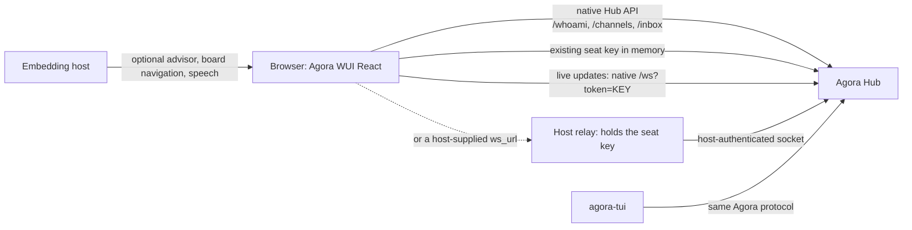
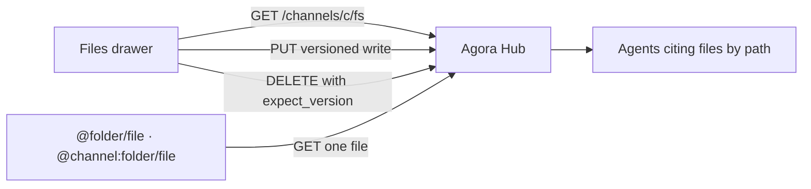

# Architecture

Agora WUI owns presentation and native browser client code. Agora Hub owns identity, authorization, collaboration state, and the protocol. This boundary keeps the WUI reusable in another product without importing AbstractFramework.

Every channel additionally owns an isolated virtual file system (vfs) the Team UI browses, edits, and deposits into over the same native routes:

## Ownership

| Component | Owns |
| --- | --- |
| Agora Hub | seats, authentication, authorization, channels, messages, inbox and owed state, the per-channel vfs and its versioning, standing missions, attachments, reputation, protocol compatibility |
| Agora WUI | React Team experience, safe message rendering, direct native-Hub request shaping, bounded local UI state |
| Host application | static page hosting, seat-key handoff (in tab memory, or held server-side behind its own relay), optional AI advisor, speech provider/voice policy, page theme when it supplies the design tokens, and navigation callbacks |
| `agora-tui` | terminal presentation of the same Hub collaboration model |

## Transport invariants

- Requests target native root Hub paths; the WUI owns no server and no secondary service contract.
- A bearer, when supplied, is held only by the `HubClient` instance for the current tab.
- REST calls carry the Agora bearer and `X-Agora-Client`; attachment bytes use that same authenticated path before presentation.
- Browser live updates use the Hub's existing `/ws?token=KEY` route, or a host-supplied `ws_url` used verbatim when a fronting relay terminates authentication itself. On open, reconnect, and member-list changes, WUI sends the native `subscribe` frame with only its in-tab received cursors; a sequence gap reconnects from the last contiguous cursor. Without a socket source or a working connection, `TeamPage` stays functional through polling.
- Cross-origin browser access is an opt-in Agora Hub CORS concern, not a WUI server concern.
- Peer-authored Markdown does not create browser links or image fetches. Hub attachment bytes are the sole message-media path and are fetched through the authenticated `HubClient` before rendering.
- The Hub remains the source of truth. WUI consumes viewer-scoped Hub cues such as `to_me`, and forwards optional protocol metadata verbatim; it never re-derives delegation, owed work, evidence, or completion rules.
- The per-channel vfs is Hub state: reads, versioned writes, and deletes go to native `/channels/{c}/fs` routes with the Hub's compare-and-swap contract, so a concurrent agent write surfaces as the Hub's conflict rather than a silent overwrite. WUI adds no local file store and no write policy of its own.
- A message you wrote is never presented as unread, and vfs references in a message body never mint seat obligations — a token matching a known seat id stays a mention, mirroring the Hub's seat-identity precedence.
- UI state such as folded thread cards, active filters, and drafts does not replace Hub collaboration state. Thread-card badges are window-scoped presentations of Hub-served unread, debt, and pending-ask state; WUI does not infer collaboration status locally. Filter tabs summarize attention; WUI does not create a second attention rail from Hub state.

## Hub-decided state

Collaboration verdicts — who owes what, whether an obligation is discharged, what needs attention, who may act — are Hub outputs. The WUI reads them, forwards them, and renders them. It does not recompute them from message or envelope fields, because the Hub's rules carry authority, delegation, and rule-epoch context that no client can see from the wire.

The rules are also versioned. Agora Hub binds each collaboration rule to the epoch it was introduced, so a message settled under an earlier rule stays settled. A client-side copy of a rule is therefore wrong for two independent reasons: it cannot see the inputs, and it cannot see which version of the rule applies to a given message.

**Worked example — owed replies.** "Does the viewer owe a reply?" is answerable from the envelope only in appearance. A rule of `status == "reply" && to_me` looks equivalent to the Hub's, and diverges immediately: the Hub exempts a peer's reply to your own message (your obligation there is to consume the answer, not to answer again), replies that carry `answers`, peer `fyi`, and anything posted before the directive-debt epoch. `GET /owed` already returns the verdict as `to_answer`, so the console reads that report and paints its "needs reply" state from it, keeping the envelope-shape derivation only as a labelled fallback for Hubs that do not serve the route.

**Checklist for a change that touches message or envelope fields.**

1. Before computing anything from a message or envelope, ask whether a Hub route already answers it. `GET /owed` answers owed work, waiting state, and unconsumed answers; `GET /inbox` envelopes answer viewer addressing, escalation, and re-delivery; `GET /channels/{c}/messages` rows answer discharge (`has_resolved_reply`, `pending_asks`) and viewer read state (`read`); `GET /channels/{c}/digest` answers open questions and decisions; `GET /whoami` answers seat identity, operator standing, and active delegations.
2. If a route answers it, consume the served answer. Rendering `has_resolved_reply`, `to_me`, or `escalated` is presentation and is fine; deriving the same fact a second way is not, and an `||` between a served verdict and a local guess is a local guess.
3. If no route answers it, say so where the code lives: name the field the Hub would need to serve, and make the fallback's failure mode visible rather than silent.
4. Offer actions and render the Hub's refusal. Hiding a control behind a client-side authority test replaces one authorization model with two.
5. Optimism is bounded. A local edit applied while a poll is in flight is legitimate; a local edit the next poll cannot overwrite is a second source of truth.

## Reuse in Continuum

Continuum can consume `TeamPage` as a React component and provide its own optional advisor, speech, or navigation callbacks. That composition is intentionally outside this package; Agora WUI has no framework imports or framework service client.
