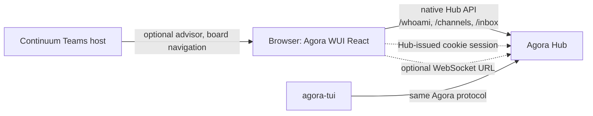

# Architecture

Agora WUI owns presentation and native browser client code. Agora Hub owns identity, authorization, collaboration state, and the protocol. This boundary keeps the WUI reusable in another product without importing AbstractFramework.

## Ownership

| Component | Owns |
| --- | --- |
| Agora Hub | seats, authentication, authorization, channels, messages, inbox and owed state, files, attachments, reputation, protocol compatibility |
| Agora WUI | React Team experience, safe message rendering, polling, native-Hub request shaping, local UI state |
| Host application | page hosting, Hub browser session, optional cookie-authenticated WebSocket URL, optional AI advisor and navigation callbacks |
| `agora-tui` | terminal presentation of the same Hub collaboration model |

## Transport invariants

- Requests target native root Hub paths; the WUI owns no server and no secondary service contract.
- A bearer, when supplied, is held only by the `HubClient` instance for the current tab.
- The client uses `credentials: "same-origin"` and never derives a WebSocket URL from a bearer.
- Without a Hub-issued WebSocket URL, `TeamPage` stays functional through polling.
- The Hub remains the source of truth. UI state such as expanded messages, active filters, and drafts does not replace Hub collaboration state.

## Reuse in Continuum

Continuum can consume `TeamPage` as a React component and provide its own optional advisor or navigation callbacks. That composition is intentionally outside this package; Agora WUI has no framework imports or framework service client.
